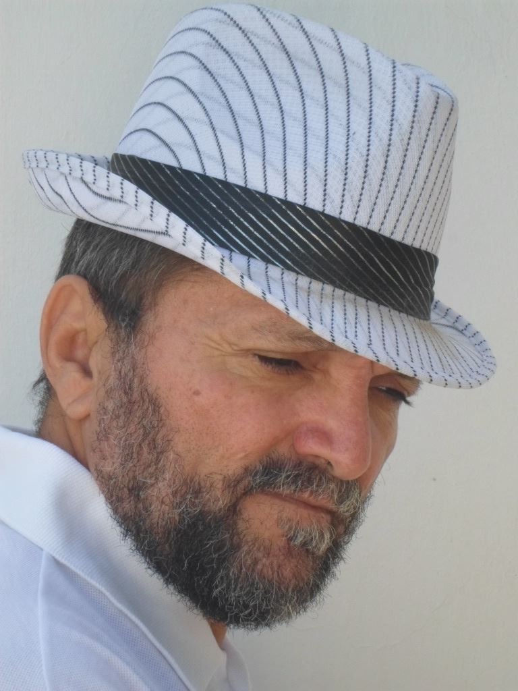

# Quem é Ciriégola?

## Introdução

Podemos estar espantados com tantos nomes diferentes. Logo o prefácio é assinado por __Alice Iorg__, __Glícia Ero__, __Crol Iagie__, __Ciriégola__, __Grilo Caié__, então o mistério se resume a apenas um, __Alcigério__. Essas palavras são todas pseudo-anagramas^[É dito pseudo-anagrama porque de fato os anagramas são palavras formadas de um outro nome, de modo que estas outras palavras são formadas com letras juntas, isto é, os anagramas. Como alguns dos nomes são formados por duas palavras, consideraremos psedo-anagramas.] de Alcigério, teríamos um total, se considerarmos apenas palavras simples, 362.879 anagramas possíveis.

Isso representa que o poeta José Alcigério Batista, Figura \@ref(fig:ciriegola), significa o todo e ao mesmo tempo nenhum. Parece um paradoxo, mas de fato uma verdade, pois em toda a sua obra, expõe temas aparentemente a frente da época em que foi escrito, até situações cotidianas, que muitas vezes desprezamos esses simplórios momentos. E com tudo isso, sua simplicidade limita ao vazio, de modo a dizer que vive a vida pelo prazer de simplesmente viver.

```{r, echo = FALSE, label=ciriegola, out.width='50%', fig.align='center', fig.cap='Foto de José Alcigério Batista (Ciriégola), popularmente Léo Batista.'}

```

Peço licença a todos que me leem, mas esta é a pessoa que nessa existência representa o pai que me ensinou a caminhar, e hoje sem buscas, apenas caminho por caminhar. Pesquisar, dissertar, ou adjetivar uma pessoa de nosso convívio parece fácil, mas ao mesmo tempo desafiador, porque quanto mais pesquisamos, sabemos que não o conhecemos. Tanta riqueza ao meu lado, e ainda bem, que em sua plena vitalidade, posso transmitir para as nossas gerações, e para aqueles que desejarem apreciar, um pouco do seu acervo poético.

Já de muito tempo eu guardava as composições, poesias, melodias e textos de meu pai, já que as inspirações são voláteis e imediatas, muitas vezes esquecidas pelo autor. E como fã que sou, armazenava todo esse material a sete chaves. Porém, toda obra guardada é mesmo que nada! Dito isso, resolvi documentar nesse livro o acervo de poesias escritas por ele. A vontade de tornar todo esse material registrado em um livro, partiu dos próprios filhos (Ben Dêivide de Oliveira Batista e Álefe de Oliveira Batista), e eu estou como autor apenas como um intermediador desse processo.

Ao final, não teremos apenas um material para ler, mas para experienciar. Contarei uma dentre tantas histórias vivenciadas com uma das poesias de Ciriégola, mas popularmente chamado de _Léo Batista_ na cidade de Pau dos Ferros/RN, local onde reside até os dias atuais.

Em 2011, tive que mudar do estado do Rio Grande do Norte devido aos estudos, e fui parar em Minas Gerais juntamente com a minha esposa, mais precisamente em Lavras/MG. Durante o mestrado um fato místico aconteceu comigo. Na casa de um amigo, estávamos minha esposa (Allanna Lopes), o referido amigo e eu, também com a presença de seus pais, e um desentendimento ocorreu ao ponto do pai com uma mediunidade ostensiva, se desequilibrar mentalmente devido ao atrito gerado naquele momento. Tentando contornar a situação, me veio a lembrança de uma das grandes poesias de Ciriégola, apresentada na subseção \@ref(poem:afirm-peregrino), __Afirmações De Um Peregrino__. Sem mais, começo a cantar em voz alta no momento da discussão. Não lembro de muita coisa no que acontecia na casa naquele momento, eu só me concentrava nessa oração. Minha esposa conta que a minha voz mudou completamente, como a de uma pessoa idosa. Ao cantar essa música, instantaneamente tudo começou a se acalmar como se ela invadisse os nossos corações. Por fim, com tudo resolvido, choramos e nos abraçamos, e assim, nunca mais esse fato fugiu de minha memória, como uma experiência de boas lembranças.

Este exemplo mostra que as poesias documentadas desse poeta no presente livro, não devem ser apenas lida, mas estudadas, tomada como reflexões, sentidas. Um outro exemplo é o __Nosso Mantra: GRASPILUXIMUTECODEFAVON__, poesia ou mantra (como queiram) na subseção \@ref(poem:mantra), vivendo frequentemente em meu cotidiano. Ao mesmo tempo, não trate esse exemplo como uma Verdade, mas simplesmente a minha experiência vivida. Eu poderia falar aqui de tantas outras, mas quero deixar para que você leitor o desfrute com a sua própria leitura, as sensações e experiências.

Mas, voltando a indagação do próprio capítulo, quem é Ciriégola? Nada melhor do que ele mesmo para explicar sobre si e o objetivo do próprio livro, . Essa descrição é apresentada na seção a seguir.


## Solilóquio com prelúdio

_Há 50 anos atrás “eu” (um dentre muitos outros EUS) tinha, ou pensava que tinha, uma religião, uma militância política, um time de futebol favorito, enfim, tinha muitas “ideologias”, inclusive permeava-me a mente fortemente a pegada de que precisava publicar (tornar público minhas ideias) e mostrar para “os outros” que eu era GENIAL. Isso era o EGO que só me levava para a publicação de um livro, pois era a maneira mais viável, na minha época,  de me fazer conhecido e elogiável. Dessa forma, evidente era o que os hormônios de minha unidade física jovem desejava para perpetuar a espécie e dá vazão a minha testosterona. Como tudo muda e já vão 66 Luas nas costas, muitas cicatrizes na face e calos nos pés, posso, de forma muito interessante e insana, ver o mundo por um outro prisma porque quando “a ficha cai”, quando o vendaval da REALIDADE desnuda  as pessoas de tudo aquilo que é FÚTIL e nebuloso, então assim a existência toma outro rumo totalmente diferente daquilo que o vulgo chama de NORMAL e esse EU PENSANTE é, hoje, totalmente insano e anormótico._

_Por vias do meu destino e “sorte” tenho guardado alguns rascunhos de letras musicais, poemas, pequenos ensaios sobre meus pontos de vista (e vistas de um ponto), quadrinhas, versos soltos, e muita prosa emblemática proveniente da própria ânsia de caminhar e vagar em busca de mim mesmo, aliás o meu trabalho neste planeta é a AUTOCONSCIÊNCIA, mais nada tem sentido, mais nada me interessa. Então meus dois filhos (as duas colunas do meu templo pessoal) têm me questionado e instigado a publicar esse pequeno legado com um fim de preservar essa pequena memória para suas gerações futuras e até que concordei, com uma condição: eles organizariam todo o material e fizessem dele o que bem fosse dos seus interesses._

_O presente material não tem como situá-lo em uma linha de tempo lógico em relação a cronologia e temática, ficarei, deveras muito contente, se conseguirem captar no seus instantes o significado do que por mim foi escrito no meu instante, já que eu independo de tempo para tudo que faço. Viver de forma grandiosa, para mim, é não se perder desse AGORA, vivo intensamente o meu instante, pois sei que a minha eternidade depende tão somente da forma como vejo as coisas, ao meu modo. Possivelmente esse é o fato de que pouca coisa tem interesse para mim nesse sistema e querem saber o porquê? Tudo aqui é falso, todos os valores estão invertidos, vivemos uma situação holográfica puramente hipotética e a Física Quântica fala exatamente disso e os religiosos e políticos morrem de medo do povo ACORDAR, mas isso é uma OUTRA história. Curta um pouco dessa insanidade e atire a sua pedra se achar que é também NORMAL._

Para complementar a sua própria percepção bem como os objetivos do livro, o poeta Manoel Cavalcante^[Natural de Pau dos Ferros/RN, dentre tantas congratulações, uma merece destaque que é fazer parte da Acedemia Norte-Rio-Grandense de Literatura de Cordel de Trovas do Rio Grande do Norte.] nas mídias sociais, mais precisamente, no _blog_ [cultura Pau-Ferrense](http://culturapauferrense.blogspot.com/2015/12/o-bardo.html), descreve de forma magistral toda trajetória de Ciriégola até os tempos atuais, que pode ser lida na seção seguinte. Fizemos algumas adaptações, com a permissão do autor.

## Ciriégola por Manoel Cavalcante

_José Alcigério Batista (Léo Batista) é natural de São Miguel/RN, nasceu no dia 13 de setembro de 1955. Filho de seu Alcides Batista e Josefa Josélia Batista, tem dez irmãos: 5 homens e 5 mulheres. Casou com Francisca Leite de Oliveira Batista, Dona Chica, [...] Neste laço, gerou dois filhos varões. Morou em São Paulo, Brasília, Natal, Campos do Jordão, Fortaleza, Mossoró, se formou no ano de 1984 em Letras Inglês pela antiga FURN^[Hoje é chamada UERN, Universidade Estadual do Rio Grande do Norte.] e se pós graduou em Linguagem pela UNP^[Universidade Potiguar.]. Em São Paulo, no ano de 1978, foi gerente de uma loja de tecidos no Brás, em 1977, viveu ganhando alguns trocados como cuidador de um deficiente visual. É funcionário público do estado, professor de língua inglesa. Recebeu o título de cidadão Pau-ferrense em 09 de dezembro de 2011._

_Afora tudo isso ou consoante a, eu falo de um espírito de luz chamado Léo Batista, o Bardo, o Xamã Aventureiro, o Falcão Ligeiro. Léo é o poeta das melodias, é o dono da curva das palavras, é o irmão dos sons. Pousou em nossas terras, se firmou, construiu seu clã e nos deu de presente uma obra sobre-humana e surreal. Quem nas vielas de Pau dos Ferros nunca ouviu falar no [SERTÃO DE METAL](https://bendeivide.github.io/arts/sertaodemetal/), uma visão futurista, composta em meados dos anos 70, que retrata justamente a realidade que vivenciamos hoje? Os tempos do sabiá de metal mal polido... Nos anos 80 e 90, depois dos folguedos da sorveteria de Sales Correia, Léo e Círio (seu companheiro inseparável) derramaram suas liras na Praça do Pavilhão e construíam seus nomes na cultura de nossa cidade. Gravaram juntos em 1996, o disco que leva o nome dessa composição mais famosa “o sertão de metal”, LP que roda nas radiolas do mundo todo e até hoje faz sucesso por todos os recantos do planeta._

_Léo é místico, doce, humano e sobretudo, alma, um homem de alma, um humano interior, de fé. Além do Sertão de Metal, oração de nossas terras, Léo possui uma obra imensa e ainda inédita, privilegiados aqueles que chegaram a ouvir, numa esquina, num encontro etílico, o verbo em melodia de nosso Falcão Ligeiro._

_Como uma espécie de irmão, filho e fã de toda a sua obra, eu tenho esse privilégio de conhecer seu mundo além do Sertão de Metal, dois pontos:
Escrava de Ouro, Musa Linda, Cidade, Margaridas da Favela, Afirmações de um Peregrino, Passarinho de Estrada, Pseudo-cidadão, Terra Sem Males, Pimpolho e tantas outras que não chegaram aos ouvidos da massa, dos jovens, que é de embriagar e revoltar ao mesmo tempo, diante de tanta beleza virgem e não conhecida._

_A obra do Xamã Aventureiro não tem idade, é telúrica, é espiritual, é naturalista, um tratado de conduta humana, um templo sagrado. O que dizer da mística ATMA-LUZ, Da melodiosa e dolente VELHICE PRECOCE? Do bucólico POR FAVOR, SEU CAPITÃO? [...] Eita, velho Bardo, nós somos felizardos por sermos devotos de sua carga poética. E seu legado ecológico nas canções? Que as energias façam com que isso tudo ganhe forma de gás e esteja ao alcance da respiração de todos._

_Você seria mil livros, mil postagens, por enquanto, ficaremos com essa amostra de sua passagem poética permanente, de seus trabalhos intensos. Avante mestre, chapéu na cuca, barba anarquista e revolucionária e verso na voz... “Há de existir um lugar onde o tempo pára para ver o jegue relinchar, onde o mundo é de todos nós...”_

## Estrutura dos próximos capítulos

Bem, após toda essa explanação sobre Ciriégola, quero deixar claro que a ideia não é fazer desse livro exatamente a biografia de José Alcigério Batista. Mas tentar juntar grande parte de suas poesias, textos ou prosas, seja em forma de música ou não, nesse material. Desse modo, dividimos as poesias em oito temas gerais, descritos um por capítulo, e dentro de cada capítulo, uma sequência de poesias referente ao tema. Os temas são: o poeta pela obra, fauna, flora e misticismo, lugares, declarações, família, curiosidades, adjetivações e o bom combate. Em cada capítulo, introduziremos um pouco sobre o que representa cada tema, apresentando algumas particularidades sobre algumas poesias selecionadas para o capítulo.

Espero que desfrutem a arte de Ciriégola, pois o material foi idealizado com muito carinho e dedicação.


