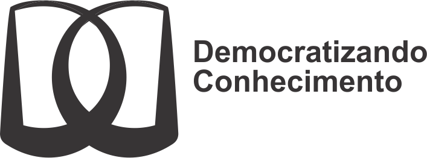

--- 
title: "Pelos caminhos de Ciriégola"
author: "Ben Dêivide"
date: "2024-11-08"
output:
  html_document:
    df_print: paged
site: bookdown::bookdown_site
bibliography: biblio.bib
biblio-style: apalike
link-citations: yes
url: https://bendeivide.github.io/book-ciriegola/
github-repo: bendeivide/book-ciriegola
csl: abnt.csl
---

<!-- <a href="https://bendeivide.github.io/books/ciriegola/"> -->

# Bem-vindo {-}

 Esse é um *livro digital* intitulado __"[Pelos caminhos de Ciriégola]()"__, com o selo [Democratizando Conhecimento (DC)](https://bendeivide.github.io/dc/). O Livro é um convite para mergular nas poesias, textos e prosas de José Alcigério Batista, o Ciriégola.

O número de leitores  que acessaram esse livro:
 
<!-- hitwebcounter Code START -->

          

## Livro físico {-}

- [Shopee](https://shopee.com.br/product/880978340/14993816937/){target="_blank"}
- [Mercado livre](https://produto.mercadolivre.com.br/MLB-2844606023-livro-pelos-caminhos-de-ciriegola-capa-triplex-brilhosa-impresso-interna-preto-e-branco-_JM){target="_blank"}
- [Amazon](https://www.amazon.com/-/pt/dp/650035611X/ref=sr_1_1?qid=1652557080&refinements=p_27%3ABen+D%C3%AAivide+de+Oliveira+Batista&s=books&sr=1-1&text=Ben+D%C3%AAivide+de+Oliveira+Batista){target="_blank"}

## ISBN {-}

- __ISBN__ (Digital): 978-65-00-35612-0
- __ISBN__ (Brochura): 978-65-00-35611-3
- __ISBN__ (Capa dura): 978-65-00-45302-7

## Licença {-}

 Este trabalho está sob a Licença <a rel="license" href="http://creativecommons.org/licenses/by-nc/4.0/">Creative Commons - Atribuição-NãoComercial 4.0 Internacional</a>.

# Como citar {-}

- Como citar essa obra (Impresso):

BATISTA, B. D. O.. __Pelos caminhos de Ciriégola__. 1ed. Pau dos Ferros, RN:[sn]. 2021. 92p. ISBN 978-65-00-35611-3.

- Como citar essa obra (Digital):

BATISTA, B. D. O.. __Pelos caminhos de Ciriégola__. 1ed. Pau dos Ferros, RN:[sn]. 2021. 92p. ISBN 978-65-00-35612-0. Disponível em: <https://bendeivide.github.io/book-ciriegola/>

# Dedicatória {-}

Para Pachamama,

Para os Irmãos da Guarnição,

Para os Meus Antepassados,

Para os Meus Irmãos Encantados,

Para todo nosso Clã,

Para todos os irmãos que ainda estão na Província do RN e para todos os que já foram para o Oriente Eterno,

Para VOCÊ, o INOMINÁVEL,

Dedico.

# Epígrafe {-}

Ser poeta não é necessariamente saber fazer o verso, mas dizer as coisas com beleza e graça, é ter certeza de que sua emoção é boa e construtiva para poder motivar os outros; é ter inteligência o suficiente para fazer do instante um grande momento. Ser poeta, gentil e sábio é saber ver na essência das pessoas nossas semelhanças e nossa paixão pela eternidade. 

José Alcigério Batista

# Prefácio {-}

Alegra-nos o coração a presente iniciativa e boa vontade do jovem Ben Dêivide de Oliveira Batista em deixar grafado um pouco do trabalho deixado por seu pai, José Alcigério Batista, mais conhecido como Léo Batista. Quanto ao seu genitor temos vivido juntos com esse buscador por mais de seis décadas e ninguém mais, ninguém melhor do que “nós” sabe a trajetória desta alma velha inexoravelmente apaixonada pela imortalidade de suas convicções inusitadas e apaixonado pelas pessoas humildes e simples do seu tempo nas escolas públicas. Trouxe na sua genética os traços funcionais do seu pai, construtor de açude, o mestre Alcides Batista, e o jeito mágico de ver as coisas da professora de alfabetização Dona Josélia Batista, sua genitora. O material contido neste opúsculo é o resultado dos arquivos esquecidos de Léo e garimpados por Ben Dêivide ao longo de muitos anos. Jamais foi o desejo do professor tornar público seu pensamento em forma de prosa, verso ou música, tendo em vista a má interpretação e má uso daqueles conceitos pelas mentalidades jovens e dessa forma gerar “causa e efeito” negativo na sua própria trajetória encarnatória como aconteceu num pretérito não muito distante de nós. Estes excertos são todos carregados de magia e misticismo como assim foi e é a existência desse operário da educação, não estão sujeitos ao tempo de nosso tempo e foram moldados de forma anárquica e antisectária, não foram confeccionados com um fim de publicidade egóica, mas como um registro pessoal do seu “instante” ao entendimento da sua geração filial futura. Nós que acompanhamos “na pele” a trajetória deste mensageiro sabemos quão sofrida é a missão de quem vem para este orbe com a CONSCIÊNCIA aflorada para além do seu tempo e isto está marcado nos seus solilóquios que aqui foram grafados, é evidente que esta essência não se encaixe na compreensão de muitos, posto que não se pode ver qualidades nos outros quando não se tem as mesmas no arquivo interior. Ademais, o leitor com um pouco de sagácia será atraído pelo mistério que existe na arte literária modesta deste visionário artesão do verbo. Congratulamo-nos com o professor Ben Dêivide pela iniciativa da sua intenção em publicar parte da obra mandingueira do seu pai e amigo. Lembremos sempre que “O AMOR é a FONTE, a ALEGRIA é o PODER e a Vida é a CELEBRAÇÃO”.

Alice Iorg, Glícia Ero, Crol Iagie, Ciriégola, Grilo Caié...

